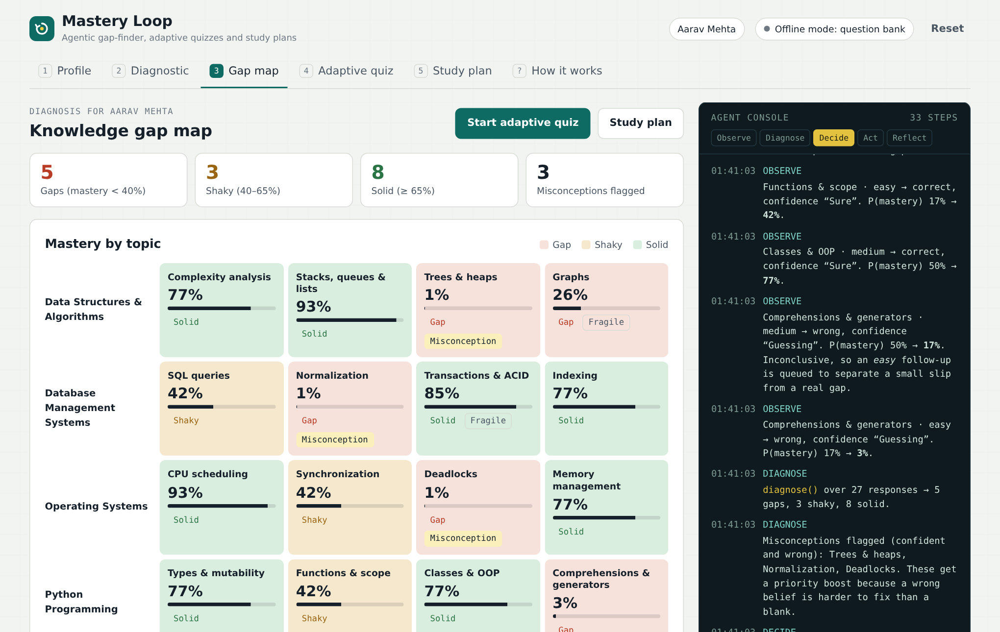
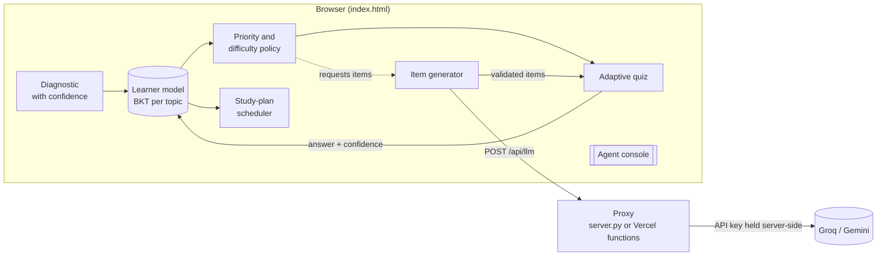
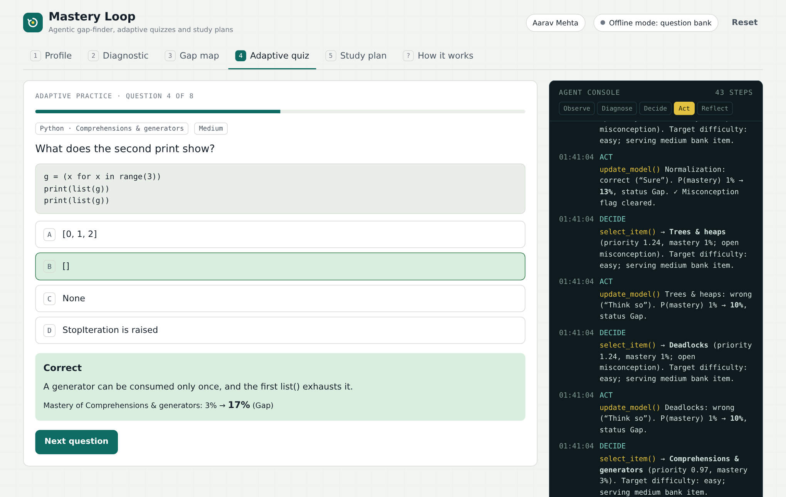
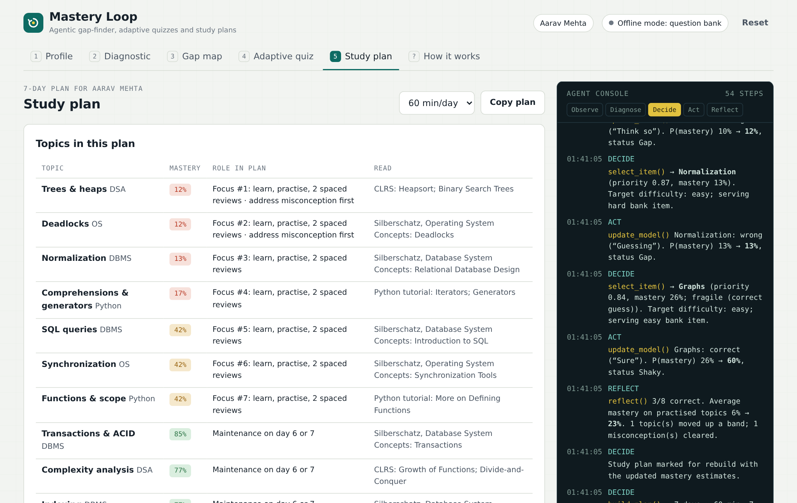

# Mastery Loop

**An agentic AI tutor that identifies gaps in a student's knowledge and automatically generates adaptive quizzes and personalised study plans.**


<p align="center">
  
</p>

---

## Contents

1. [Abstract](#1-abstract)
2. [Motivation](#2-motivation)
3. [System overview](#3-system-overview)
4. [Methodology](#4-methodology)
5. [Architecture and implementation](#5-architecture-and-implementation)
6. [Getting started](#6-getting-started)
7. [Deployment](#7-deployment)
8. [Using the application](#8-using-the-application)
9. [API reference](#9-api-reference)
10. [Limitations](#10-limitations)
11. [Future work](#11-future-work)
12. [Privacy and security](#12-privacy-and-security)
13. [References](#13-references)
14. [Authors, citation and licence](#14-authors-citation-and-licence)

---

## 1. Abstract

Mastery Loop is a web-based intelligent tutoring system for undergraduate computer science. An autonomous agent runs a closed **perceive → diagnose → decide → act → reflect** loop:

1. It gives a short adaptive diagnostic in which every answer is paired with a self-reported confidence rating.
2. It maintains a per-topic probability of mastery using **Bayesian Knowledge Tracing (BKT)**, with confidence-adjusted evidence that separates lucky guesses and confident misconceptions from ordinary errors.
3. It ranks topics with a priority function and chooses each practice item and its difficulty accordingly.
4. It uses a large language model (LLM) as a *tool* to write new multiple-choice items aimed at the specific misconceptions revealed by the student's wrong answers, validating every item before use.
5. It produces a 7-day study plan with spaced review, scaled to the student's daily time budget.

Every decision is written to a visible agent console, so the system's reasoning can be inspected step by step. The MVP covers 4 subjects, 16 topics and a curated bank of 64 items, and it degrades gracefully to the curated bank when no LLM is available.

## 2. Motivation

Fixed-length quizzes treat every student the same and report a single score. That score hides *which* concepts are missing and *why*. Three observations shape this project:

- **A wrong answer is ambiguous.** It may be a slip, a blank, or a firmly held misconception. Confidence-based assessment (Gardner-Medwin, 2006) shows that pairing answers with confidence separates these cases, and confident errors are the most important to correct.
- **Practice should follow the gap.** Adaptive systems that model knowledge per skill, such as Knowledge Tracing (Corbett & Anderson, 1994), target practice where it has the most effect. Intelligent tutoring systems built this way show substantial learning gains (Kulik & Fletcher, 2016).
- **Static question banks run out.** LLMs can write new items on demand, but their output must be constrained and validated before a student sees it.

## 3. System overview



| Agent phase | What happens | Code (in `index.html`) |
|---|---|---|
| **Observe** | Record each answer, the confidence rating and the item's difficulty | `answerDiag`, `answerAd` |
| **Diagnose** | Update P(mastery), flag misconceptions and fragile knowledge, classify topics | `bkt`, `finishDiag` |
| **Decide** | Rank topics, choose the next item and its difficulty, build the plan | `priority`, `selectNext`, `buildPlan` |
| **Act** | Serve items, call the LLM to generate items, explain errors, write the coach note | `nextQ`, `generateAI`, `askTutor`, `askCoach` |
| **Reflect** | Compare mastery before and after practice and mark the plan for rebuilding | `finishAdaptive` |

## 4. Methodology

### 4.1 Domain model

Each subject contains four topics. Each topic has four curated items: one easy, two medium and one hard, with a written explanation for every item.

| Subject | Topics |
|---|---|
| Data Structures & Algorithms | Complexity analysis · Stacks, queues & lists · Trees & heaps · Graphs |
| Database Management Systems | SQL queries · Normalization · Transactions & ACID · Indexing |
| Operating Systems | CPU scheduling · Synchronization · Deadlocks · Memory management |
| Python Programming | Types & mutability · Functions & scope · Classes & OOP · Comprehensions & generators |

### 4.2 Adaptive diagnostic

The diagnostic borrows the core idea of computerised adaptive testing (Wainer, 2000): ask more only where the evidence is inconclusive.

- Every topic starts with one **medium** probe.
- A **wrong** answer queues an **easy** follow-up, to separate a slip from a real gap.
- A **correct but unsure** answer ("Think so" or "Guessing") queues a **hard** follow-up, to test depth.
- A **correct and sure** answer ends probing for that topic.

No feedback is shown during the diagnostic, so responses reflect prior knowledge. A full diagnostic takes between *n* and 2*n* items for *n* topics.

### 4.3 Learner model: confidence-adjusted Bayesian Knowledge Tracing

For each topic the agent keeps $P(L)$, the probability that the student has mastered it, initialised to $P(L_0) = 0.5$. After each response it applies the standard BKT update (Corbett & Anderson, 1994):

$$
P(L \mid \text{correct}) = \frac{P(L)\,(1-S)}{P(L)\,(1-S) + (1-P(L))\,G}
\qquad
P(L \mid \text{wrong}) = \frac{P(L)\,S}{P(L)\,S + (1-P(L))\,(1-G)}
$$

$$
P(L') = P(L \mid \text{obs}) + \bigl(1 - P(L \mid \text{obs})\bigr)\,T
$$

Here $G$ is the guess probability, $S$ the slip probability and $T$ the learning transition. The parameters depend on item difficulty:

| Difficulty | Guess $G$ | Slip $S$ |
|---|---|---|
| Easy | 0.25 | 0.10 |
| Medium | 0.25 | 0.15 |
| Hard | 0.20 | 0.20 |

**Confidence adjustments.** Earlier work improved BKT by estimating slip and guess from context (Baker, Corbett & Aleven, 2008). This project applies a simple version of that idea, using self-reported confidence as the context:

- A correct answer marked **Guessing** sets $G = 0.6$, because a lucky guess is weak evidence. The topic is flagged **fragile**.
- A wrong answer marked **Sure** halves $S$, because a confident error is strong evidence of non-mastery. The topic is flagged as a **misconception**.
- $T = 0$ during the diagnostic, where no feedback is given, and $T = 0.1$ during practice, where every answer is followed by an explanation.
- $P(L)$ is clamped to $[0.01, 0.99]$.

A later correct answer given with confidence clears the misconception flag. Topics are classified as follows:

| Status | Condition |
|---|---|
| **Gap** | $P(L) < 0.40$ |
| **Shaky** | $0.40 \le P(L) < 0.65$ |
| **Solid** | $P(L) \ge 0.65$ |

### 4.4 Decision policy

**Topic priority.** Each topic gets a priority score:

$$
\text{priority} = \bigl(1 - P(L)\bigr) + 0.25 \cdot \mathbb{1}[\text{misconception}] + 0.10 \cdot \mathbb{1}[\text{fragile}]
$$

Misconceptions are boosted because correcting a wrong belief is harder and more important than filling a blank.

**Item selection.** Before each practice question the agent does the following:

1. Scores each topic as priority − 0.35 × (the number of times the topic appeared in the last two items). This keeps the practice varied.
2. Chooses the highest-scoring topic that still has unseen items.
3. Sets a target difficulty from mastery: easy if $P(L) < 0.40$, medium if $P(L) < 0.65$, hard otherwise.
4. Serves the unseen item closest to the target difficulty, preferring LLM-generated items on ties.

A practice round has 8 items. At the end, the agent reports accuracy, the change in average mastery on the topics practised, the topics that moved up a band, and the misconceptions cleared.

### 4.5 LLM-based item generation

When practice starts, the agent picks the three highest-priority topics that are not solid. It sends the LLM a structured prompt containing:

- the topic, its key ideas and the estimated mastery;
- whether a misconception is flagged, and the target difficulty;
- the student's **actual wrong answers**: the question, the chosen option, the confidence rating and the correct option.

It asks for two new items per topic in a fixed JSON schema. Each returned item is **validated** before it enters the pool:

- The `topic_id` must be one of the student's selected topics.
- There must be exactly four options.
- `answer` must be an integer from 0 to 3.
- Difficulty is clamped to 1–3, and text fields are truncated to safe lengths.

Options are then **shuffled**, so the answer's position carries no signal. Generation runs in the background, and practice starts right away with curated items. If generation fails or returns nothing valid, the agent logs this and continues with the bank.

The LLM is also used for two optional tasks: a short explanation of why the student's chosen wrong option is wrong, and a personalised coach note for the study plan.

### 4.6 Study-plan scheduling

The planner turns the learner model into a 7-day schedule. It uses spaced practice, which improves long-term retention compared with massed practice (Cepeda et al., 2006).

- **Focus topics.** Up to 7 non-solid topics, taken in priority order, are introduced across days 1–5. Each gets a *learn* block (25 min for a gap, 15 min for shaky) and a *practice* block (20 or 15 min).
- **Spaced review.** Each focus topic gets 10-minute reviews 2 and 5 days after it is introduced, when those days fall within days 1–6.
- **Maintenance.** Solid topics get a 10-minute maintenance block on day 6 or day 7.
- **Mock quiz.** Day 7 opens with a 20-minute mixed mock quiz across all topics, which feeds the next diagnosis.
- **Time budget.** When a day exceeds the daily budget, its blocks are scaled down proportionally and rounded to 5-minute units. When 10 minutes or more are left over, a *flex practice* block on the top-priority topic is added.
- **Resources.** Each topic links to a standard reference: CLRS for DSA, Silberschatz's *Database System Concepts* and *Operating System Concepts*, and the official Python tutorial.

## 5. Architecture and implementation

### 5.1 Repository layout

```
mastery-loop/
├── index.html        # Complete front end: UI, item bank, BKT, policy, planner, agent console
├── api/
│   ├── _lib.js       # Shared provider logic (Groq / Gemini), model discovery, error handling
│   ├── health.js     # GET  /api/health  (Vercel serverless function)
│   └── llm.js        # POST /api/llm     (Vercel serverless function)
├── server.py         # Local server with the same API, Python standard library only
├── start.bat         # Windows launcher for server.py
├── .env.example      # Configuration template
├── docs/             # Screenshots
├── LICENSE
└── CITATION.cff
```

### 5.2 Design decisions

- **No build step and no framework.** The client is a single HTML file with vanilla JavaScript, so it is easy to audit, host and grade. The only external resource is Google Fonts, with system-font fallbacks.
- **Key isolation.** The browser never sees the API key. All LLM calls go through a thin proxy: `server.py` locally, or `api/*.js` on Vercel. Both expose the same two endpoints.
- **Provider-agnostic.** The provider is detected from the key prefix: `gsk_` means Groq, `AIza` means Gemini. The model is found at runtime by listing the models available to the key and picking the first from a preference list, so the app keeps working when a model is retired.
- **Graceful degradation.** Every AI feature is optional. With no key, a rejected key or a network failure, the app runs entirely on the curated bank and says so in the interface.
- **Persistence.** Session state is kept in the browser's `localStorage`. No server-side database is needed for the MVP.
- **Transparency.** Each step of the agent loop is logged with the function it called and the values that drove the decision.

### 5.3 Technology stack

| Layer | Technology |
|---|---|
| Client | HTML5, CSS custom properties (light and dark themes), vanilla ES2020 JavaScript |
| Local server | Python 3.8+ standard library (`http.server`, `urllib`) |
| Cloud | Vercel static hosting and Node.js serverless functions |
| LLM providers | Groq (OpenAI-compatible Chat Completions, JSON mode) or Google Gemini (`generateContent`) |

## 6. Getting started

### 6.1 Prerequisites

- Python 3.8 or newer, for local use.
- An API key from either provider:
  - Groq: https://console.groq.com/keys (keys start with `gsk_`)
  - Google AI Studio: https://aistudio.google.com/apikey (keys start with `AIza`)

### 6.2 Run locally

```bash
git clone https://github.com/<your-username>/mastery-loop.git
cd mastery-loop
cp .env.example .env        # On Windows: copy .env.example .env
# Edit .env and set LLM_API_KEY=<your key>
python server.py            # On Windows you can double-click start.bat
```

The app opens at **http://localhost:8000**. The terminal reports the provider, the model and the connection status.

### 6.3 Configuration

| Variable | Required | Description |
|---|---|---|
| `LLM_API_KEY` | Yes, for AI features | A Groq (`gsk_…`) or Gemini (`AIza…`) key |
| `LLM_MODEL` | No | Model to use, e.g. `llama-3.3-70b-versatile` or `gemini-2.5-flash`. By default the app picks one automatically. |
| `LLM_PROVIDER` | No | `groq` or `gemini`. Overrides detection from the key prefix. |
| `PORT` | No | Local server port. Defaults to `8000`. |

## 7. Deployment

### 7.1 Vercel (recommended)

1. Push the repository to GitHub, making sure `.env` is **not** committed.
2. On https://vercel.com, go to **Add New → Project** and import the repository.
3. Set **Framework Preset** to *Other* and leave the build and output settings empty.
4. Under **Environment Variables**, add `LLM_API_KEY` (and `LLM_MODEL` if you want a specific model).
5. Click **Deploy**.

Vercel serves `index.html` as a static page and deploys `api/health.js` and `api/llm.js` as serverless functions. Every later `git push` redeploys the site automatically. After changing an environment variable, go to **Deployments → Redeploy** for it to take effect.

### 7.2 Other hosts

- **Render, Railway, or a VPS.** Run `python server.py` as a web service with `LLM_API_KEY` set. On these hosts, change the bind address in `server.py` from `127.0.0.1` to `0.0.0.0` and use the platform's `PORT` value.
- **Static hosting only** (GitHub Pages, Netlify without functions). The app runs in offline mode using the curated bank, because there is no proxy for AI calls.

## 8. Using the application

1. **Profile.** Enter a name, choose subjects and a daily study time, and toggle AI item generation.
2. **Diagnostic.** Answer each item, then rate your confidence. The keyboard works too: `1`–`4` choose an answer, and `S`, `T` or `G` submit it as Sure, Think so or Guessing.
3. **Gap map.** See each topic's mastery estimate, status and flags. Select a topic to see the answers behind its estimate.
4. **Adaptive quiz.** Answer 8 agent-selected items, with explanations, mastery updates and optional AI tutoring on wrong answers.
5. **Study plan.** Review the 7-day spaced plan, copy it, or ask the LLM for a personal coach note.

<p align="center">
  
  
</p>

For demonstrations, **Run demo student** answers the diagnostic as a simulated learner with mixed strengths, and **Auto-answer (demo)** simulates practice responses with a probability of success that rises with current mastery.

## 9. API reference

Both the local server and the Vercel deployment expose the same interface.

### `GET /api/health`

Checks the configured key by listing the provider's models, and reports the model selected.

```json
{ "ok": true, "provider": "groq", "model": "llama-3.3-70b-versatile",
  "label": "Llama 3.3 (Groq)", "error": "" }
```

### `POST /api/llm`

Forwards a single-turn prompt to the provider.

Request:

```json
{ "prompt": "string (max 60,000 characters)", "json": true }
```

`json: true` requests structured output: JSON mode on Groq, `responseMimeType: application/json` on Gemini.

Response:

```json
{ "text": "model output" }
```

| Status | Meaning |
|---|---|
| `200` | Success |
| `400` | Empty prompt |
| `429` | The provider's rate limit was reached |
| `502` | The provider returned an error, or the request failed |
| `503` | The AI is not configured (missing or rejected key) |

Error responses have the form `{ "error": "message" }`.

## 10. Limitations

- **Hand-set parameters.** The BKT parameters are set by hand, not fitted to data, so the mastery estimates are indicative rather than calibrated.
- **Independent topics.** Topics are modelled independently. The system has no prerequisite structure; for example, weakness in *Trees & heaps* does not inform *Graphs*.
- **Small bank.** Each topic has only four curated items, so a single session can use up the bank. LLM generation offsets this but is not guaranteed.
- **Structural validation only.** Generated items are checked for format, not for factual correctness. A wrong answer key from the LLM is still possible.
- **Single learner, one browser.** Progress is saved only in the current browser. There are no accounts, no instructor view and no long-term tracking.
- **No evaluation yet.** The system has not been evaluated with real students. The learning-gain figures it reports are the model's own estimates.

## 11. Future work

- Fit BKT parameters per topic from class response data using expectation–maximisation, or compare against Deep Knowledge Tracing and Performance Factors Analysis.
- Add a prerequisite graph between topics, so that evidence propagates to related topics.
- Add a second-pass verifier that re-solves each generated item and rejects items where the two answers disagree, plus an instructor approval queue.
- Add accounts, a server-side database and an instructor dashboard with class-level gap analysis.
- Let instructors upload their own syllabus and question banks.
- Run a controlled study that compares learning gains, measured with pre- and post-tests, against fixed-order practice.

## 12. Privacy and security

- The API key is held only on the server (`.env` or Vercel environment variables) and is never sent to the browser. `.env` is listed in `.gitignore`.
- Student responses stay in the student's browser (`localStorage`). They leave the device only as part of LLM prompts, which contain the question text, the chosen options, the confidence ratings and the student's display name for the coach note.
- A public deployment lets anyone with the link use the configured key's quota. Share links only with your intended audience, and rotate keys that may have been exposed.

## 13. References

- Baker, R. S. J. d., Corbett, A. T., & Aleven, V. (2008). More accurate student modeling through contextual estimation of slip and guess probabilities in Bayesian Knowledge Tracing. In *Intelligent Tutoring Systems (ITS 2008)*, Lecture Notes in Computer Science, vol. 5091, pp. 406–415. Springer.
- Cepeda, N. J., Pashler, H., Vul, E., Wixted, J. T., & Rohrer, D. (2006). Distributed practice in verbal recall tasks: A review and quantitative synthesis. *Psychological Bulletin, 132*(3), 354–380.
- Corbett, A. T., & Anderson, J. R. (1994). Knowledge tracing: Modeling the acquisition of procedural knowledge. *User Modeling and User-Adapted Interaction, 4*(4), 253–278.
- Gardner-Medwin, A. R. (2006). Confidence-based marking: Towards deeper learning and better exams. In C. Bryan & K. Clegg (Eds.), *Innovative Assessment in Higher Education* (pp. 141–149). Routledge.
- Kulik, J. A., & Fletcher, J. D. (2016). Effectiveness of intelligent tutoring systems: A meta-analytic review. *Review of Educational Research, 86*(1), 42–78.
- Wainer, H. (Ed.). (2000). *Computerized Adaptive Testing: A Primer* (2nd ed.). Lawrence Erlbaum Associates.
- Yao, S., Zhao, J., Yu, D., Du, N., Shafran, I., Narasimhan, K., & Cao, Y. (2023). ReAct: Synergizing reasoning and acting in language models. In *International Conference on Learning Representations (ICLR)*.

## 14. Authors, citation and licence

**Authors:** *Nandini Saxena;*

If you use this work, please cite it using [`CITATION.cff`](CITATION.cff). GitHub shows a **Cite this repository** button for this file.

Released under the [MIT License](LICENSE).
